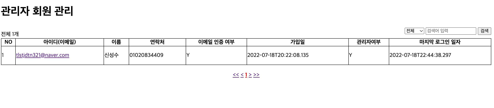
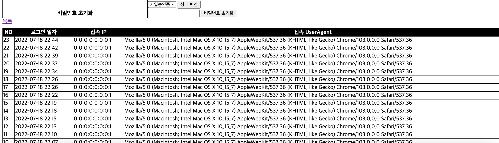
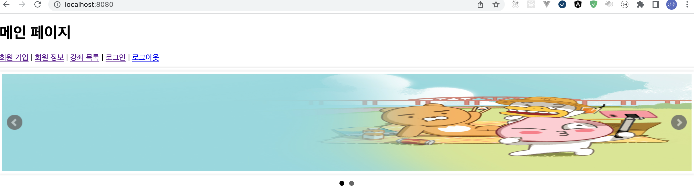
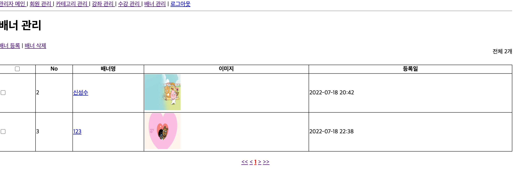
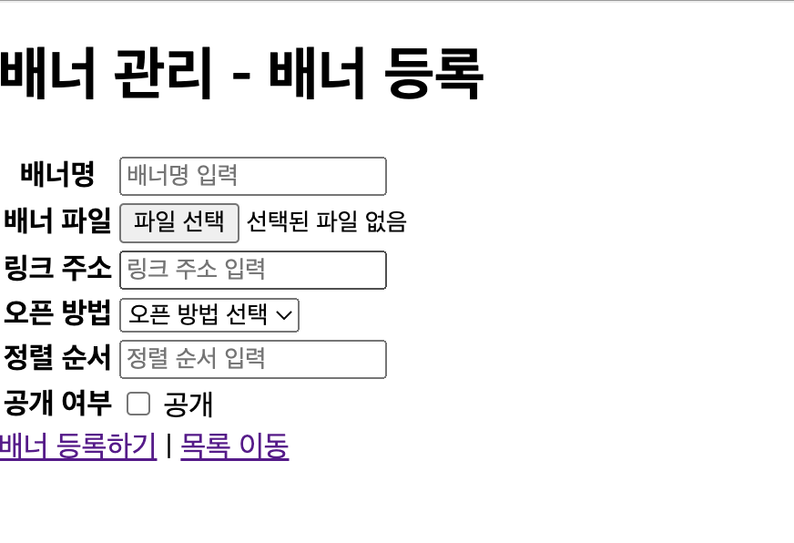
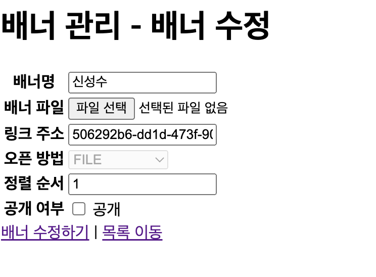

# fastlms

## 기능정리

- [x] 로그인 히스토리 추가
- [x] 배너
  - [x] 배너 등록 기능
  - [x] 배너 삭제 기능
  - [x] 배너 수정 기능
  - [x] 메인에 배너 넣기

#### 화면

1. 로그인 히스토리 추가

2. 로그인 히스토리 추가- 2

3. 메인화면

4. 배너 화면

5. 입력 화면

6. 수정

